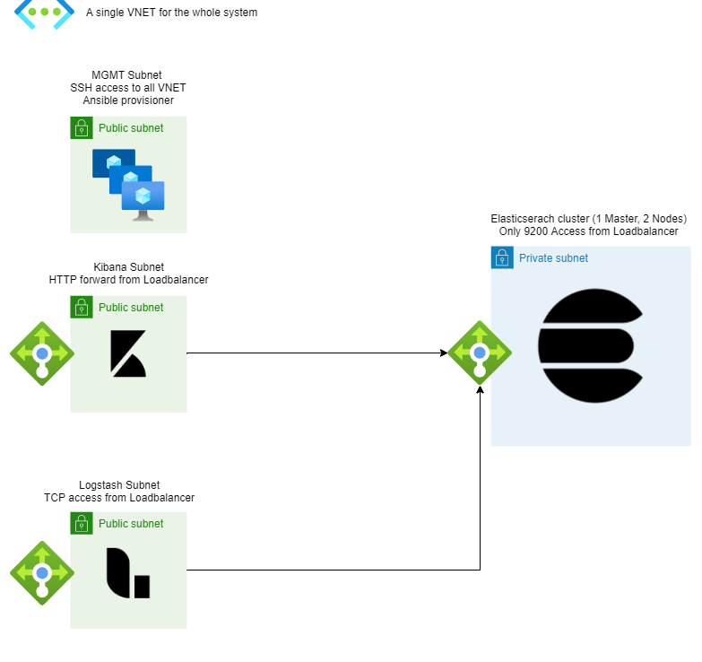

# Deploy ELK Stack on Azure with Terraform, Ansible, and GitHub Actions
Terraform configuration to deploy infrastructure in Azure. Ansible configuration to provision ELK stack in the resources. Everything automated with GitHub Actions.



## Terraform:
Terraform deploys the following modules within a single resource group:

- Elasticsearch: 
  - 3 VMs (one master and 2 nodes) Standard_B2s
  - 1 Load Balancer
- Kibana
  - 2 VMs for redundancy, Standard_B2s
  - 1 Load Balancer
- Logstash
  - 2 VMs for redundancy, Standard_B2s
  - 1 Load Balancer
- MGMT
  - 1 autoscaling VM, with Ansible to provision the resources
- Network
  - 1 VNET
  - 1 Subnet for each service (Elasticsearch, Kibana, Logstash, MGMT)
  - Network Security Groups to only allow required access for each service

Future releases planned modules: 
- Kafka
- Index push from GitHub and Ansible to show state of the configuration
- Separate VMs using Availability Zones

**WARNING:** The estimated price of this configuration is X monthly

## Ansible

TODO

## GitHub Actions

- On push to Main:
  - Runs `terraform apply -auto-approve` to a remote state in Terraform Cloud
  - Provisions ELK stack using Ansible
  - Gathers information from the infrastructure created and saves it to artifacts

# How to use

## Requirements

- A Terraform Cloud account for remote state
- An Azure Service Principal account 
- To increase the Azure quota for B series instances (10 CPUS to 20)

## Saving secrets to the repo

This configuration needs secrets to access Azure and Terraform Cloud

For Azure: 
1. Using Azure CLI, run this command to create a Service Principal, with contributor access to the subscription (change SUBSCRIPTION-ID)

`az ad sp create-for-rbac --name "GitHub" --sdk-auth --role="Contributor" --scopes="/subscriptions/SUBSCRIPTION-ID"`

2. Save the output in a secret names `AZURE_CREDENTIALS`, going to the repository Settings > Secrets > Actions. The format needs to be the following:

```
  {"clientId": "CHANGE-ME",
  "clientSecret": "CHANGE-ME",
  "subscriptionId": "CHANGE-ME",
  "tenantId": "CHANGE-ME",
  "activeDirectoryEndpointUrl": "CHANGE-ME",
  "resourceManagerEndpointUrl": "CHANGE-ME",
  "activeDirectoryGraphResourceId": "CHANGE-ME",
  "sqlManagementEndpointUrl": "CHANGE-ME",
  "galleryEndpointUrl": "CHANGE-ME",
  "managementEndpointUrl": "CHANGE-ME"}
```

3. From the same output, save the values of the following keys to unique secrets (used by Terraform deployment)

```
ARM_CLIENT_ID = clientId
ARM_CLIENT_SECRET = clientSecret
ARM_SUBSCRIPTION_ID = subscriptionId
ARM_TENANT_ID = tenantId
```
4. In Terraform Cloud, go to app.terraform.io/app/settings/tokens, and create a new API token. Save the token in a key called `TF_API_TOKEN`

5. Change the organization and the workspace name in the root [main.tf](main.tf) for the name of yours. 